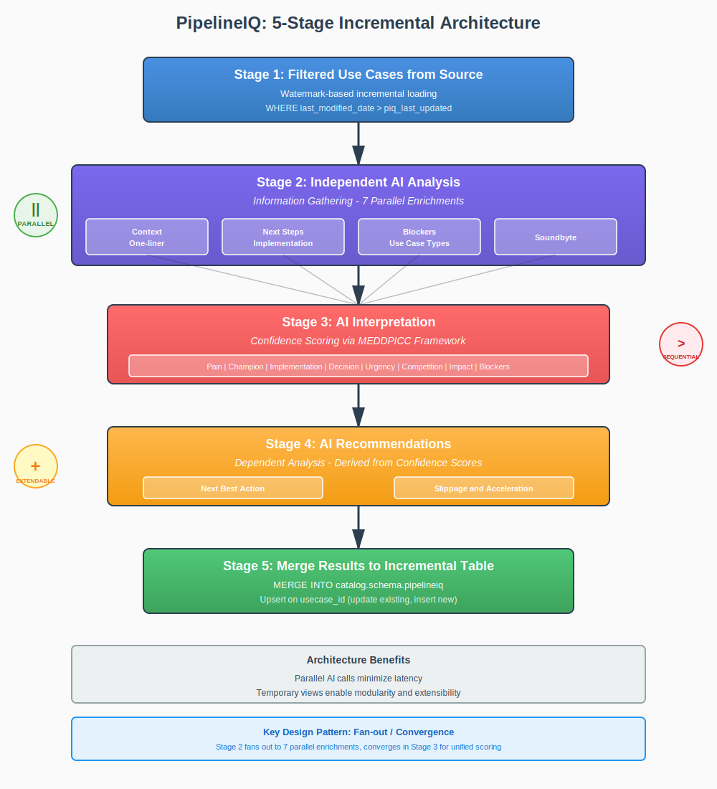
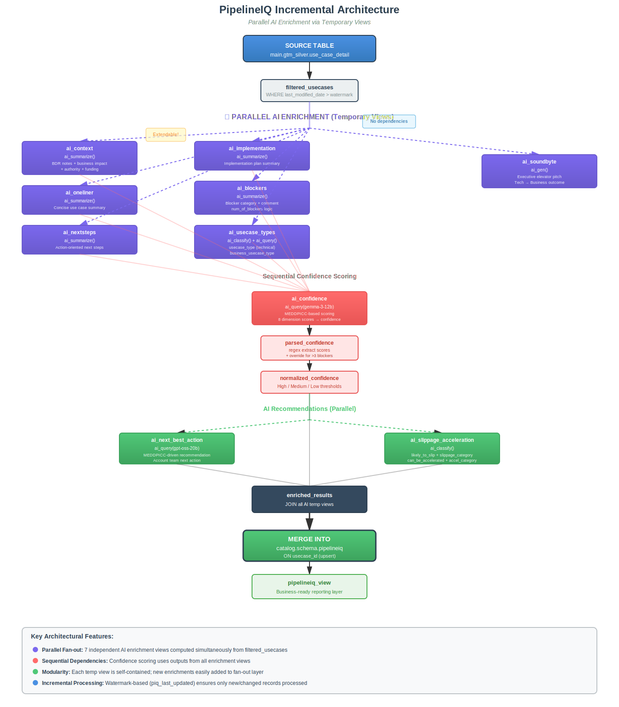

Risk and acceleration analysis of Databricks use cases over the next six months, focused on supporting Sales and Field Leadership (SLM/FLM) coaching and pipeline management.

## Overview

**PipelineIQ** is an AI-powered pipeline management system that analyzes Databricks use cases from Salesforce to assess confidence levels, identify slippage risks, and recommend acceleration opportunities. The system processes use case data incrementally using Foundation Model APIs to generate MEDDPICC-based confidence scores, business context summaries, and actionable recommendations for account teams.

### Technical summary
❗️❗️**PipelineIQ** adds a 'what do i do now' layer of augmentation on top of a single dataset, `silver.use_case_detail`. It's a new table, with lots of AI function calls that joins back to `silver.use_case_detail` ❗️❗️

### Repository Structure

```
DpipelineIQ/
├── dashboards/                    # Lakeview dashboard definitions
│   ├── piq_main.lvdash.json       # Main PipelineIQ dashboard
│   └── piq_sales_managers.lvdash.json  # Sales manager summary view
├── databricks.yml                 # Asset Bundle configuration
├── deployment_resources/          # Deployment configurations
│   ├── dashboards.yml             # Dashboard deployment settings
│   └── workflows.yml              # Workflow job definitions
├── docs/                          # Documentation and diagrams
│   ├── pipeline_architecture.svg  # Logical flow diagram
│   ├── pipeline_overview.svg      # High-level overview diagram
│   └── upgrade_to_incremental_plan.md
├── exploratory/                   # Exploratory analysis notebooks
│   ├── Confidence Analysis.ipynb
│   ├── GPU Radar.ipynb
│   ├── Managers Summary View.ipynb
│   └── Technical coverage.ipynb
├── imgs/                          # Image assets
├── utils/                         # Utility scripts and notebooks
│   ├── __init__.py
│   └── update_dashboard_params.ipynb  # Dashboard parameter updater
├── workflow/                          # Production pipeline notebooks
│   ├── 0_create_ref_tables.ipynb      # Reference table setup
│   ├── 1_incremental_pipeline.ipynb   # Core incremental processing
│   ├── 2_field_manager_summary_view.ipynb
│   └── 2_sales_manager_summary_view.ipynb
└── README.md                      # This file
```

### Asset Bundle Deployment

This repository manages Databricks resources using Asset Bundles with two deployment targets:

- **`dev` target**: Deploys workflows only to a development workspace for testing. Uses parameterized catalog/schema (e.g., `users.your_name`).
- **`prod` target**: Deploys workflows AND dashboards to production. Dashboards are published with persistent URLs. Only deploy from `main` branch.

**Resources managed:**
- **Workflows** (`deployment_resources/workflows.yml`): Scheduled jobs for incremental pipeline processing and summary view generation
    ```mermaid
      flowchart LR
      0[Setup reference tables]
      1[Incrementally update pipelineIQ]
      2a[Create sales manager view]
      2b[Create field manager view]
      0 --> 1 --> 2a & 2b
    ```
- **Dashboards** (`deployment_resources/dashboards.yml`): Lakeview dashboards for sales managers and field leadership
  - `piq_main.lvdash.json` - Main PipelineIQ dashboard
  - `piq_sales_managers.lvdash.json` - Sales manager summary view

### PipelineIQ Processing Architecture

The pipeline uses **watermark-based incremental processing** to minimize compute costs and API calls:

1. **Incremental Loading**: Only processes use cases modified since last run (tracked via `piq_last_updated` watermark)
2. **Parallel AI Enrichment**: Uses temporary SQL views to fan out AI generation steps independently
3. **Merge Strategy**: MERGE INTO target table, updating only changed records
4. **Minimized Storage**: PipelineIQ table stores only AI-enriched columns + IDs; joins back to source (`main.gtm_silver.use_case_detail`) for reporting

**Key AI Enrichments:**
- **Context & Summaries**: Business impact, one-liners, next steps, implementation notes, blockers
- **Classification**: Technical use case type, business use case label, executive soundbyte
- **Confidence Scoring**: MEDDPICC-based confidence assessment (Pain, Champion, Implementation Plan, etc.)
- **Recommendations**: Next best actions, slippage risk categories, acceleration opportunities

### How the Incremental Pipeline Works

The core processing logic lives in [`workflow/1_incremental_pipeline.ipynb`](./workflow/1_incremental_pipeline.ipynb).

**Architecture: Fan-Out → Join Pattern**

The notebook uses a sequence of temporary views to parallelize AI enrichment steps:

```
filtered_usecases (base)
  ↓
  ├→ ai_context
  ├→ ai_oneliner
  ├→ ai_nextsteps
  ├→ ai_implementation
  ├→ ai_blockers
  ├→ ai_usecase_types
  ├→ ai_soundbyte
  ├→ ai_confidence
  ├→ parsed_confidence
  ├→ normalized_confidence
  ├→ ai_next_best_action
  └→ ai_slippage_acceleration
       ↓
  enriched_results (joins all views)
       ↓
  MERGE INTO pipelineiq table
```

Each temporary view:
1. Takes `filtered_usecases` (or prior enrichment views) as input
2. Applies one AI function (`ai_summarize`, `ai_classify`, `ai_query`, `ai_gen`)
3. Returns `usecase_id` + new AI-generated columns
4. Gets LEFT JOINed in the final `enriched_results` view

**Contributing: Adding a New AI Enrichment Step**

To add a new AI-generated field:

1. **Create a temporary view** with your AI logic:
```sql
CREATE OR REPLACE TEMPORARY VIEW ai_your_new_field AS
SELECT 
  usecase_id,
  ai_summarize(
    CONCAT('Your prompt here: ', COALESCE(source_field, 'default')),
    100  -- max tokens
  ) AS your_new_field
FROM filtered_usecases;
```

2. **Add the LEFT JOIN and column** to `enriched_results`:
```sql
-- In the "Create complete AI output view" cell
LEFT JOIN ai_your_new_field ynf ON base.usecase_id = ynf.usecase_id
```

3. **Add the column to SELECT**:
```sql
SELECT 
  base.usecase_id,
  -- ... other fields ...
  ynf.your_new_field,
  -- ... rest of fields ...
```

4. **Update table schema** if persisting to `pipelineiq` table (add column comment in CREATE TABLE DDL)

## Getting Started

### Prerequisites

- Access to Databricks workspace with Unity Catalog enabled
- Databricks CLI installed and configured
- Access to `main.gtm_silver.use_case_detail` source table

### Initial Setup

1. **Clone the repository**
```bash
git clone <repo-url>
cd DpipelineIQ
```

2. **Create your dev schema** (if using non-default):
```sql
CREATE SCHEMA IF NOT EXISTS users.<your_name>;
```

3. **Deploy the dev bundle**:
```bash
databricks bundle deploy -t dev
```

This creates the workflow in your workspace. You can run it manually or wait for the schedule.

4. **Parameterize for your environment**:
   - Open `workflow/1_incremental_pipeline.ipynb` in Databricks
   - Set the `catalog` and `schema` widgets to your target location (e.g., `users` and `your_name`)
   - The notebook will auto-create the `pipelineiq` table on first run

### Running the Pipeline

**Option 1: Run via Databricks Workflow (recommended)**
```bash
databricks bundle run -t dev incremental_pipeline_job
```

**Option 2: Run notebook directly**
- Open `workflow/1_incremental_pipeline.ipynb` in Databricks
- Set widgets: `catalog=users`, `schema=your_name`
- Run all cells

### Deploying to Production

⚠️ **Only deploy prod from `main` branch, preferably from CICD runner as SP**

```bash
git checkout main
databricks bundle deploy -t prod
```

This deploys workflows + publishes dashboards with persistent URLs.

# Dev notes

## First time run? Start here
You should bootstrap your version of your `pipelineiq` table to your own repo. To do this:

1. Clone the repo, create your dev schema with DBSQL if it doesnt exist and you are using a non-default value (default will be users.your_name, which should exist.)
1. Open the notebook [workflow/1_incremental_pipeline](./workflow/1_incremental_pipeline.ipynb), plug in your values for `catalog` and `schema` to the widget.
    1. Run the first cell only (the large python config cell), this will tell you it is attempting to detect an existing pipelineIQ table and will create an empty one with appropriate schema.
    1. UNCOMMENT the SQL in the second cell that runs `insert into`, changing `users`.`luis_herrera`.`pipelineiq` to a catalog/schema representing an existing, up to date version of pipelineIQ.
    1. IMMEDIATELY RECOMMENT, then deploy the dev bundle target and you can run the workflow to populate all tables.

## Lifecycling Dashboards

AIBI Dashboards and version control still has some rough edges. Heres how this works:
- Asset bundles can publish dashboards from a given filepath. KEYWORD: **Publish**. This deployment should only happen against the version you want to have a persistent URL for (Like a go/ link).
-  We have two asset bundle deployments, `dev` and `prod`. Only prod deploys dashboards, and it should only be deployed from the `main` branch.
- If you are **DEVELOPING** a dashboard, you simply branch the repo into the workspace, then directly modify the `dash_name.lvdash.json` (which is a non-published, draft version unique to your working tree)
- Never change the actual file name, you can update the display name in `deployment_resources/dashboards.yml` to increment a version name, but the file name should stay programmer friendly.
- Since we cant current parameterise dashboards with asset bundles, the version committed to the repo needs to be using the correct `catalog` and `schema` arguments. For this, I've made a **interactive notebook** [utils/update_dashboard_params](./workflow/1_incremental_pipeline.ipynb). Plug in your values for `catalog` and `schema` in your branch and run it to update all parameters in the dashboard to the correct values.
- When youre ready to commit changes back, switch the `pre-commit` widget value to true to update the dashboard parameters back to main branch compliance values (`home_luis_herrera.pipelineiq`)
- If you are adding new datasets, copy the `USE IDENTIFIER(:PARAM);` snippets exactly from another dataset query.

## Diagrams

### Overview



### Logical flow for incremental pipe

